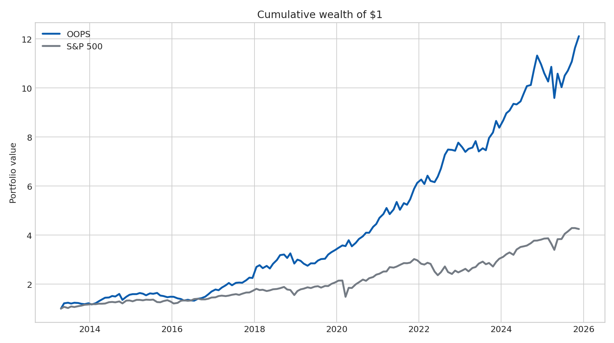
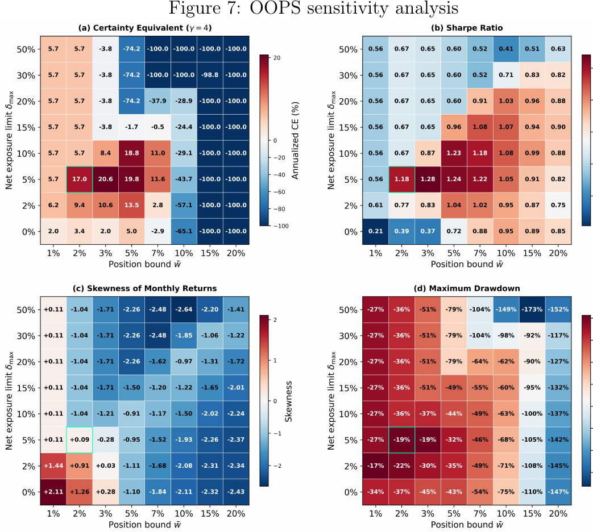
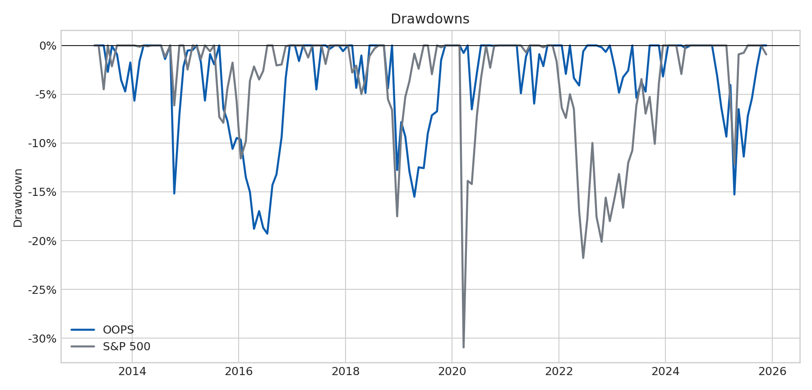

# Optimal Option Portfolio Strategies on the S&P 500

Replication and out-of-sample extension of the **Optimal Option Portfolio
Strategies (OOPS)** framework introduced by Faias and Santa-Clara (2017).
This repository accompanies my B.Sc. Economics thesis at the University of
Freiburg, which was graded **1.0**.

> **Research question:** Can a conditional bootstrap combined with CRRA
> utility maximization construct attractive option portfolios after quoted
> bid-ask spreads and explicit risk constraints are taken into account?

## Main results

The primary specification uses a 2% per-position cap, a 5% net-short exposure
limit, CRRA risk aversion of 10, and 10,000 bootstrap scenarios at each monthly
rebalancing date.

| Metric | OOPS | S&P 500 |
|---|---:|---:|
| Annualized mean return | 21.28% | 13.31% |
| Annualized volatility | 16.56% | 17.32% |
| Annualized Sharpe ratio | 1.18 | 0.77 |
| Annualized certainty equivalent (gamma = 4) | 17.04% | 6.23% |
| Skewness | +0.09 | -1.22 |
| Maximum drawdown | -19% | -31% |



The sensitivity analysis reveals a localized high-utility region at position
caps of approximately 2-5% and net-short limits of 5-10%. Performance
deteriorates sharply once individual position caps exceed 7%. This plateau,
rather than a single best backtest, is one of the central findings of the
thesis.



The historical drawdown comparison is shown below.



These figures are historical backtest results. They are not investment advice
and do not represent live or investable performance.

## Methodology

1. Select AM-settled S&P 500 index options at the close before the monthly
   holding period: ATM calls and puts and approximately 5% OTM calls and puts.
2. Incorporate transaction costs by treating long positions at the ask and
   short positions at the bid as separate securities.
3. Standardize monthly S&P 500 returns by lagged realized volatility and draw
   10,000 conditional bootstrap scenarios with a fixed seed.
4. Convert simulated index levels into option payoffs and scenario returns.
5. Maximize expected CRRA utility subject to non-bankruptcy, position limits,
   a net-short exposure limit, and mutual exclusivity of long and short
   positions in the same option.
6. Solve the resulting mixed-integer convex program globally with CVXPY and
   MOSEK.

The out-of-sample period covers April 2013 through November 2025 and contains
152 monthly allocation decisions. Full methodological details, robustness
tests, factor regressions, and limitations are documented in the
[thesis PDF](Bachelor_Thesis_Houshyar_Amini.pdf).

## Repository structure

```text
.
├── main.py                         # simulation and optimization pipeline
├── modules/
│   ├── config.py                   # immutable simulation configuration
│   ├── data_util.py                # data preparation and payoff functions
│   └── optimization.py             # CRRA/MICP optimization
├── scripts/
│   ├── run_baseline.py             # exact primary thesis specification
│   ├── run_sensitivity.py          # 8 x 8 hyperparameter grid
│   └── create_figures.py           # regenerate showcase figures
├── tests/                          # deterministic unit tests
├── data/                           # compact research inputs
├── log/                            # selected precomputed allocation logs
├── assets/                         # figures displayed in this README
└── Bachelor_Thesis_Houshyar_Amini.pdf
```

## Reproducing the baseline

### 1. Create an environment

Python 3.11 or newer is recommended.

```bash
python -m venv .venv
```

Activate the environment and install the dependencies:

```bash
python -m pip install --upgrade pip
python -m pip install -r requirements.txt
```

MOSEK requires a valid license. Free academic licenses are available from
MOSEK for eligible users.

### 2. Run the primary specification

```bash
python -m scripts.run_baseline
```

The baseline runner explicitly sets:

- bootstrap scenarios: 10,000;
- random seed: 999;
- CRRA coefficient: 10;
- position cap: 2% per long or short security;
- maximum aggregate net-short exposure: 5%;
- volatility windows: 1, 5, 10, 20, 30, and 60 trading days.

Results are written to `results/simulation_log_baseline.csv`. A complete run
is computationally intensive because every allocation date and volatility
window requires a mixed-integer optimization.

### 3. Recreate the public figures

The selected allocation logs in `log/` allow the cumulative-performance,
drawdown, and return-distribution figures to be created without rerunning
MOSEK:

```bash
python -m scripts.create_figures
```

The 64-configuration sensitivity panel is reproduced from the final thesis;
regenerating it requires the complete sensitivity run described above.

### 4. Run the tests

```bash
python -m pip install -r requirements-dev.txt
pytest
```

## Data

- S&P 500 and VIX histories: Yahoo Finance via `yfinance`.
- One-month Treasury yield: Federal Reserve Bank of St. Louis, DGS1MO.
- SPX option bid and ask quotes: Databento OPRA.PILLAR.

See [`data/README.md`](data/README.md) for the file-level data dictionary and
licensing notice. Market-data redistribution rights can differ from the right
to use data for research; downstream users should obtain the required source
data and permissions independently.

## Limitations

- The sample is dominated by a long equity bull market.
- 152 months provide limited power to distinguish mispricing alpha from
  compensation for crash risk.
- Very short volatility windows can create overly compressed bootstrap
  scenarios.
- The backtest models quoted bid-ask spreads but not market impact, operational
  constraints, taxes, or every real-world margin requirement.

## Reference

Faias, J. A., and Santa-Clara, P. (2017). “Optimal Option Portfolio
Strategies: Deepening the Puzzle of Index Option Mispricing.” *Journal of
Financial and Quantitative Analysis*, 52(1), 277-303.

For academic use, please cite the thesis using [`CITATION.cff`](CITATION.cff).
